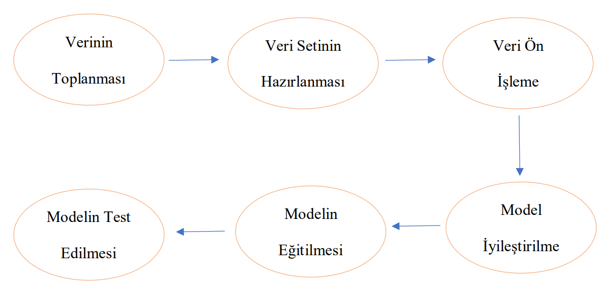
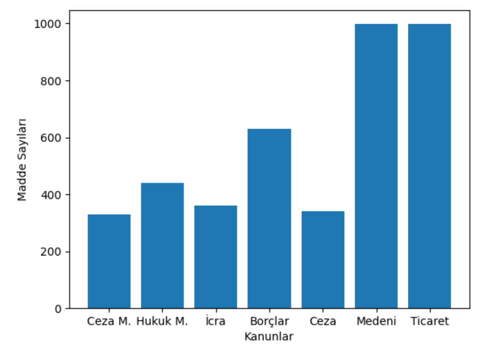
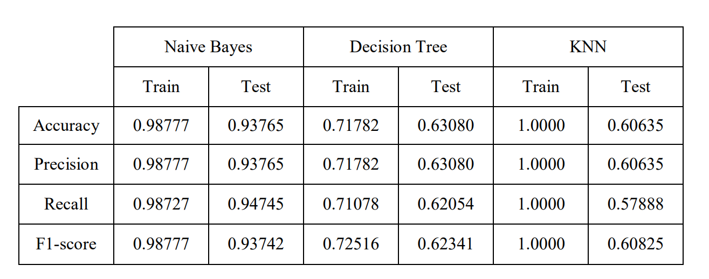
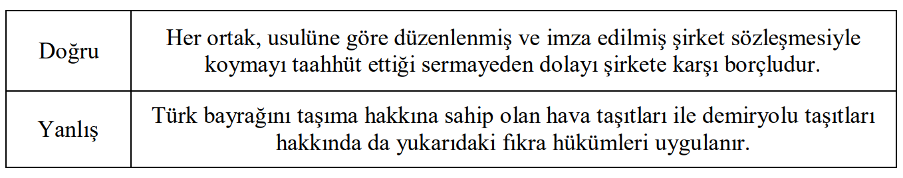

# LAWSUIT MAIL CLASSIFICATION

Bu projenin amacı hukuk bürolarına genel ve dava için önem arz eden hukuki mailleri başarılı bir şekilde sınıflandırılarak dava süreçlerinin hızlandırılmasına yardım etmekdir.

## KURULUMLAR

**Python --version 3.9.13**

```
pip install pandas
pip install numpy
pip install scikit-learn
pip install matplotlib
pip install nltk
pip install pickle5
pip install collection
pip install regex
```

## İÇİNDEKİLER

- [LAWSUIT MAIL CLASSIFICATION](#lawsuit-mail-classification)
  - [KURULUMLAR](#kurulumlar)
  - [İÇİNDEKİLER](#i̇çi̇ndeki̇ler)
  - [ÖZET](#özet)
  - [GİRİŞ](#gi̇ri̇ş)
  - [SİSTEM TASARIMI](#si̇stem-tasarimi)
  - [DENEYSEL ANALİZ](#deneysel-anali̇z)
  - [SONUÇ](#sonuç)
  - [REFERANSLAR](#referanslar)

## ÖZET

Günümüz teknolojisindeki gelişmeler birçok alanda değişikliğe sebep olduğu gibi hukuk 
alanında da çeşitli değişikliklere sebep olmuştur. Bunun en bariz örneklerden biri e-mail yolu 
ile yapılan yazışmaların delil başlangıcı kabul edilmesidir. Bu proje kapsamında da büyük 
ölçekteki avukatlık şirketlerine gelen e-maillerin sınıflandırılması ve işlem sürelerinin 
kısaltılması hedeflenmektedir. İlk olarak model eğitimine uygun, kullanılabilir bir veri seti 
oluşturmak için çalışılmıştır. Bu aşamada ilk önce kanun maddelerini içeren belgeler üzerinden 
bilgiler elde edilmiştir. Daha sonra kanun maddesi ve hangi kanuna ait olduğu bilgilerini içeren 
etiketli bir veri seti oluşturulmuştur. Veri seti eğitimde Naive Bayes, Decision Tree ve KNN 
modelleri kullanılmıştır. Modellerin eğitiminde Cross-validation yöntemi kullanılarak her 
model için en uygun parametrelerin belirlenmesi sağlanmıştır. Eğitim sonucunda en başarılı 
model Naive Bayes olmuştur. Decision Tree ve KNN modelleri eğitim verisinde belli bir başarı 
göstermişse de aynı başarıyı test verisi üzerinde gösterememişlerdir. Son olarak yanlış tahmin 
edilen örnekler belirlenerek yanlış tahmine sebep olan faktörler araştırılmıştır.

## GİRİŞ

Günümüzde, teknoloji hızla gelişiyor. Artan insan sayısı ve artan teknolojik cihaz 
kullanımıyla birlikte saniyeler içerisinde binlerce veri oluşuyor. Bu verileri işleyerek anlamlı 
bilgiler elde etmek ve çeşitli işlemlerin süresini kısaltmak ise oldukça önem kazanıyor. Gelişen 
teknoloji birçok alanda değişikliğe de sebep oluyor. İnsanların belirli bir hata oranıyla yerine 
getirebileceği görevler teknolojik gelişmelerle neredeyse sıfır hata ile tamamlanıyor. Buna 
örnek olarak son zamanlar da futbolda sıklıkla kullanılan VAR uygulamasını göstermek 
mümkün.

Bu proje kapsamında da orta ve büyük ölçekteki avukatlık şirketlerine gelen dava 
maillerinin doğru bir şekilde sınıflandırılması yapılarak hukuki işlem sürelerinin kısaltılması 
hedeflenmiştir. Bir sonraki aşamada hukuki süreçler içerisinde hâkim, savcı ve avukatlara 
yardımcı asistanlık görevini yerine getirebilecek bir projenin temellerini oluşturduğu 
düşünüldüğünde bu projenin oldukça önemli bir proje olduğunu söylemek mümkündür.
Bu proje konusuna benzer ilgili çalışmalar araştırıldığında, Türkiye de herhangi bir elle 
tutulur çalışmaya rastlanmazken yurtdışında yakın konularda bazı çalışmalar yapıldığı 
gözlemlenmiştir. Burada şu bilgiyi aktarmakta fayda var. Hukuki süreçlerin ve yürütmelerin 
yurtiçinde ve yurtdışında büyük ölçüde farklara sahip olduğu araştırma sonucunda 
gözlemlenmiştir.

Yurtdışında gerçekleştirilen benzer bir çalışmada Avrupa Birliği veri tabanı üzerinden 
elde edilen 57 bin adet yasal belge ile veri seti oluşturulmuş ve bu veri seti üzerinde CNN ve 
BIGRU modelleri eğitilerek yöntem karşılaştırılması yapılmıştır. Yapılan projede CNN ile elde 
edilen başarının yeni yöntemler kullanılarak daha başarılı sonuçlar elde etmek olduğu 
söylenebilir. Bu bağlamda benzer veri seti ile çalışılmış olsa da projelerin farklı hedefler 
doğrultusunda geliştirildiği söylenebilir.

## SİSTEM TASARIMI 

Bu proje kapsamında kullanılan veri kümesi tamamen bu projeye özel olarak sıfırdan 
oluşturulmuş bir veri kümesidir. Veri setinin oluşturulmasının ilk adımında şirketlere gelen 
dava mailleri ile çalışılması düşünülmüş ama kişisel verilerin korunması kanunu gereğince bu 
fikir hayata geçirilememiştir. Bu nokta da alanında uzman kişilerle görüşülerek maillerin 
kanunlara atıf yapması gerektiği bilgisi alınmış ve veri seti olarak kanun maddelerinin 
kullanılmasına karar verilmiştir. Toplam 7 adet kanun ile çalışılmış ve hangi kanunlarla 
çalışılacağı yine alanında uzman kişilere danışılarak belirlenmiştir. Veri kaynağı belirlendikten 
sonra veri setinin oluşturulması için bir dizi işlem adımı yapılmıştır. İlk olarak kanun maddeleri 
internet üzerinden bilgisayar ortamına indirilerek text formatına dönüştürülmüştür. Daha sonra 
her bir kanun maddesi hangi kanuna ait olduğu bilgisini içerecek şekilde etiketli bir veri seti 
oluşturulmuştur. 

Veri setinin model eğitimine hazır hale gelmesi için ilk olarak stopwords kelimeleri veri 
setinden temizlenmiştir. Bu temizleme işleminde NLTK kütüphanesinden faydalanılmıştır. 
Daha sonra veri seti içerisindeki sayılar ve özel karakterler temizlenmiştir. Daha sonra 
temizlenmiş veri üzerinde incelemeler yapılmıştır. Her bir kanun etiketi altında en çok tekrar 
eden kelimeler incelenmiştir. Bu nokta da birçok kanun içerisinde ortak olarak bulunan ve 
kelime tekrarı olarak ilk sıralarda yer alana kelimeler belirlenmiş ve ver setinden çıkarılmıştır. 
Ortak kelimelerin belirlenmesi alanında uzman kişiler ile yapılmıştır.

Metin verisindeki temizleme işlemlerinden sonra metin verisinin model eğitimine uygun 
hale gelebilmesi için önce Tokenization işlemi uygulanmıştır. Bu işlem için NLTK kütüphanesi 
altındaki word_tokenize yapısından faydalanılmıştır. Daha sonra Vectorizer işlemi 
uygulanmıştır. Bunun için Sklearn içerisindeki CountVectorizer kütüphanesi kullanılmıştır. Bu 
işlemlerden sonra veri model eğitimine hazır hale gelmiştir.



Ön işlem adımlarından geçen veri model eğitimi ve test aşamalarında kullanılmak için 
iki kısma ayrılmıştır. Bu aşamada 4089 adet veriden oluşan veri setimiz %80 eğitim verisi, %20 
test verisi olacak şekilde iki kısma ayrılmıştır. Veri seti eğitiminde Naive Bayes, Decision Tree 
ve KNN yöntemleri kullanılmıştır. Gözetimli bir öğrenme süreci olduğu için en yaygın 3 
gözetimli öğrenme yöntemi olarak bu modeller seçilmiştir. Modellerin eğitiminden önce 
GridSeachCV kütüphanesi kullanılarak her bir model için en iyi parametrelerin bulunması 
işlemi gerçekleştirilmiştir. Daha sonra her bir model en iyi parametreleri ile eğitilmiş ve model 
eğitim işlemi tamamlanmıştır.

## DENEYSEL ANALİZ

Proje başarısını ölçme adımında en iyi parametrelerle eğitilen modellerin her biri için eğitim 
ve test başarılı hesaplanmıştır. En iyi parametreleri belirleme işlemi verilerin %80’lik 
kısmından oluşan eğitim verisi üzerinde 5-fold cross-validation uygulanarak yapılmıştır. Daha 
sonra geri kalan %20’lik test verisi üzerinde tahmin işlemi gerçekleştirilerek test başarısı 
belirlenmiştir.



Başarı ölçme metriği olarak accuracy, recall, precision ve f1-score kullanılmıştır. Birden 
fazla başarı ölçme metriği kullanarak dengesiz veri setlerinde karşımıza çıkabilecek yanıltıcı 
sonuçların tespit edilmesi hedeflenmiştir.





Doğru ve yanlış sınıflandırılmış olan metinlerden birer tanesi yukarıda verilen resimde gösterilmiştir. 
Verilen örnek metinler incelendiğinde doğru sınıflandırma yapılan metinde ortak, şirket, 
sermaye gibi kelimeler metni oldukça tahmin edilebilir kılarken, yanlış sınıflandırılmış metin 
incelendiğinde oldukça yaygın kullanılan kelimeler barındırdığını ve ayırt edici bir kelimesi 
olmadığını söylemek mümkündür.

## SONUÇ

Yapılan çalışma neticesinde Naive Bayes yönteminin hukuki dava metinlerini sınıflandırma 
işleminde %94 test başarısı göstererek oldukça başarılı bir sonuç sergilemiştir. Decision Tree 
modelinin eğitim ve test başarısı ise Naive Bayes yöntemine göre oldukça düşük çıkmıştır. 
KNN modelinin eğitim başarısı %100 olsa da test başarısına bakıldığında çok düşük olduğu 
görülmüştür. Bu noktada KNN modelinin aşarı öğrenme sergilediği söylenebilir. Naive Bayes 
yönteminin başarısını arttırmak için hukuki terimler konusunda daha kapsamlı bir çalışma 
yürüterek veri setinin çok daha iyi hazırlanması düşünülebilir. Aynı zamanda veri setinin 
genişletilmesi de model başarısını arttıracağı düşünülmektedir.

## REFERANSLAR

Xu, Y., Zhang, M., Wu, S., & Hu, J. (2019, July). Lawsuit category prediction based on machine learning. 
In 2019 IEEE International Conference on Intelligence and Security Informatics (ISI) (pp. 176-
178). IEEE.

Kobayashi, V. B., Mol, S. T., Berkers, H. A., Kismihók, G., & Den Hartog, D. N. (2018). Text classification 
for organizational researchers: A tutorial. Organizational research methods, 21(3), 766-799.

Hassan, S. U., Ahamed, J., & Ahmad, K. (2022). Analytics of machine learning-based algorithms for text 
classification. Sustainable Operations and Computers, 3, 238-248.

Chalkidis, I., Fergadiotis, M., Malakasiotis, P., Aletras, N., & Androutsopoulos, I. (2020). LEGAL-BERT: 
The muppets straight out of law school. arXiv preprint arXiv:2010.02559.